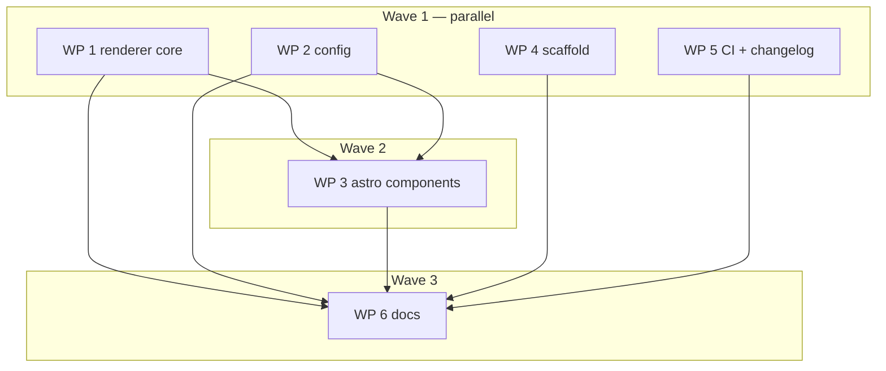

# Plan: Theme-overlay review remediation

## Status

- State:   review
- Tier:    high
- Updated: 2026-08-30
- Next:    /hex-review .agents/plans/theme-overlay-findings.md

---

## Overview

**Status:** Approved
**Date:** 2026-08-30
**Related Spec:** the `/hex-review` report on `feat/theme-overlay` (this session)
**Related ADR:** none — no ADRs in this repo

## Objective

Address every finding from the high-tier review of `feat/theme-overlay`
(3 Block, 16 High, ~12 Warn, ~10 Suggest) and land the eight decisions the
owner made at the review gate.

## Scope

### In Scope

- The eight locked decisions (Key Decisions below).
- Every Block and High finding; the Warn/Suggest findings named per WP.
- One go-red test per new guard: no verification lands that has not been
  watched fail against a planted violation.

### Out of Scope

- Pre-existing, flagged not fixed: no `.npmrc` `ignore-scripts` for this
  repo's own installs; `package.json` still publishes an `./integration`
  subpath resolving to an empty module.
- No `size-limit` budget (measured 8x under Vite's threshold).
- No uv cache for the docs job (2.2 s, on a path-filtered workflow).

## Technical Approach

This is remediation of an existing branch, not greenfield. Contract-first
TDD applies literally to the new surface (C-001..C-006, C-008..C-011); for
the edits to existing lines the Stub phase is a no-op and the Specify phase
writes the go-red test first. That asymmetry is deliberate, not a shortcut.

### Key Decisions

| Decision | Rationale |
|---|---|
| Overlay refuses `lib/**` + `content.config.ts` | Narrowing later breaks whoever overrode a now-excluded path; decidable only before the first consumer |
| Stage a pristine copy, add `@grim-original/` | `@grim/` resolves post-overlay, so an override cannot wrap what it replaced; the shipped original has no reachable specifier at all (`exports` blocks the subpath) |
| Platform-detect loop moves into `Base.astro` | `detect` is inert on every page but the shipped landing page; the docs teach it on a theme page |
| `NavLink.external?: boolean` | Header infers in/out-of-tab from href shape and the footer does not apply it at all; adding a field after `nav` is contract is a major |
| `overlayTheme` logs each replaced shipped path + version | Makes the Unstable tier honest without a manifest; the tier is free today only because `^0.4.x` pins the minor |
| Ship `CHANGELOG.md` | Two docs make "read the changelog" the sole mitigation for the Unstable tier; none exists |
| `banner` -> `notice`, slot `site-notice` | `--grim-color-banner-*` is the amber deprecation palette; last release where the rename is free |
| Warn, never fail, on a dangling nav route | Catches a typo without false-failing a legitimate `public/` target |

## Component Contracts

- **C-001** `overlayTheme(root, src)` — skips any theme path under `lib/` or
  named `content.config.ts`, printing one stderr line per skipped path.
  Every other path overlays as before. Empty/absent `theme/` unchanged.
  **The same decision binds `watchTheme`'s mirror**, not only the build copy:
  a deny-list that one of the two writers honours lets a theme author develop
  against `dev`, watch a denied file take effect, ship it, and have the build
  silently drop it. Matching is case-insensitive (APFS and NTFS are supported
  targets; CI is Linux-only and can never catch a case bypass), and the list
  is never consumed positionally. `content.config.ts` is denied at the **root
  only** — the deny exists because Astro resolves one content-collection
  entrypoint there, and a file of that basename in `components/` has no such
  meaning. Recorded as a deliberate call: it is the harder direction to
  reverse, since loosening a deny-list later breaks nobody but tightening one
  does. Both writers apply the rule as `fs.cp`'s `filter` callback, never as a
  check on the watcher's event path: `fs.watch` adds per-directory watches
  after a moved-in subtree already exists, so `mv /tmp/prepared theme/` fires
  one parent event and none for its children, and the handler's recursive copy
  would then carry the whole subtree past a per-event check. `filter` is
  per-entry, so it is correct however the copy was triggered.
  The deny-list is **not a security boundary** and the docs must not call it
  one: `fs.cp` does not dereference symlinks, so `theme/x -> ../../..` is
  copied as a live symlink regardless. It is a compatibility guard.
- **C-002** `stage(root, outDir, srcDir?)` — additionally copies
  `ASTRO_SRC_DIR` to `<dir>/original` **before** the overlay, and returns it
  as `original`. Any throw after `mkdtemp` removes the scratch dir and
  rethrows; nothing is left in the index repo. Scoped precisely to the
  `.index-*` scratch directory — `stats.json` is written into `outDir` before
  `stage` runs and is not part of this contract.
- **C-003** `inlineConfig()` — `resolve.alias` carries `"@grim-original/"` ->
  `<staged.original>/` alongside `"@grim/"`. Neither prefix swallows the
  other, nor `@grimoire-rs/`.
- **C-004** `overlayTheme` — one stderr line per overlaid path that replaces
  a **shipped** file, naming the path and the indexer version. A path that
  adds a new file is not logged.
- **C-005** `watchTheme(root, src)` — creates `theme/` if absent before
  watching, so a directory created after `dev` starts still mirrors; attaches
  an `'error'` listener that logs **and disables mirroring** without throwing;
  creation failure branches on `ENOENT` (silent) vs everything else (logged).
  Stays a **synchronous** constructor (`mkdirSync`): it returns a handle and
  every other step in it is sync, so going async would ripple three signatures
  to save one word. Its `close()` removes the `theme/` directory again **only
  if still empty** — `fs.rmdir` failing on a non-empty directory is the guard
  — so running `dev` against an index with no theme does not litter that
  repo with an empty directory it never asked for.
  The `'error'` listener must be able to reach `watchTheme`'s `stopped` flag,
  so it is a factory or an inline closure, never a module-level function.
- **C-006** `DevServer.stop()` — idempotent; a second call resolves without
  re-invoking `server.stop()` or re-removing the tree.
- **C-007** `preact-render-to-string` is a declared `dependency`, so
  `packageRoot()` resolves it under an isolated (pnpm/PnP/nested) layout.
- **C-008** `NavLink` — gains `external?: boolean`. Unset preserves today's
  href-shape inference. `SiteHeader` and `SiteFooter` apply it identically.
- **C-009** `validateLinks` — rejects a `/`-rooted href whose next character
  is `/` **or** `\`. `"/\\evil.test/x"` fails the build.
- **C-010** config key `notice` replaces `banner`; slot `site-notice`
  replaces `site-banner`. No compatibility alias — `banner` never shipped.
- **C-011** nav route check — a `/`-rooted `nav` href matching no emitted
  route and no `public/` asset prints one stderr warning naming the key.
  Never fails the build.
- **C-012** `Base.astro` — the `#theme-toggle` lookup is null-safe, and the
  `[data-os-detect]` preselect loop runs from the layout for every bar on
  every page.
- **C-013** scaffold — `theme/README.md` (tiers + docs link) replaces
  `theme/pages/.gitkeep`; `templates/tsconfig.json` sets `"module": "esnext"`
  and `"moduleResolution": "bundler"`.
- **C-014** `pages.yml` — `configure-pages` runs in its own job; `build`
  holds only `contents: read`; lychee checks external links in `build`.

- **C-015** `validate()` warns on an unrecognised top-level key in
  `index.config.json` — one stderr line naming the key. The allowlist must
  include `ci`, which `src/ci.ts` reads out of the same file and which
  `SiteConfig` does not declare. Discovered during execution: after the
  `banner` -> `notice` rename an index carrying the old key lost its notice
  with no error, and the same silence swallows any typo'd key.
- **C-016** `tsconfig.test.json` type-checks the `test` tree, exposed as an
  opt-in `typecheck:tests` script and deliberately **not** wired into
  `task check` yet — the existing tree has 94 real type errors (measured),
  which is its own piece of work. Discovered during execution: `tsconfig.json`
  includes only `src` and the lint is not type-aware, so no test file is
  type-checked at all today.

- **C-017** One shared URL-shape guard, applied everywhere a config value
  becomes a URL: `logo` (`src/config.ts:396`), `favicon` (`:376`, today
  unvalidated entirely) and the scaffold's `badLogo` duplicate
  (`src/cli/init.ts:225`) accept what `validateLinks` was fixed to reject.
  Owner-approved after a sweep found them; the branch was otherwise going to
  fix one instance of a defect and ship three siblings.
- **C-018** Userinfo is rejected consistently by every config URL validator.
  Two of four reject it today — `validateSite` with a written rationale
  ("reads as one host and fetches another"), `addRegistryUrl` in
  `catalog.ts` — and `validateLinks`/`optionalUrl` accept it silently.
  `https://good.test@evil.test/` resolves to host `evil.test`, and
  `validateSite`'s reasoning applies verbatim to a header link.

## User-Experience Scenarios

| ID | Action | Expected outcome | Error cases |
|---|---|---|---|
| S-001 | Replace `SiteHeader.astro` with no theme toggle | Every later script in `Base.astro` still runs: copy buttons, picker wiring, toast | Previously a `TypeError` killed all of them |
| S-002 | A `theme/pages/` page renders `<CommandBar detect />` | A Windows visitor sees the Windows command | Previously always the configured first choice |
| S-003 | Set `nav[].external` true/false | Link opens in the requested tab, header and footer alike | Unset falls back to href-shape inference |
| S-004 | Put a file at `theme/lib/data.ts` | Build warns, skips it, succeeds | — |
| S-005 | An override imports `@grim-original/components/SiteHeader.astro` | Resolves to the shipped original | Previously self-imported |
| S-006 | Create `theme/` after `dev` has started | The new page serves without a restart | Previously 404 forever, silently |
| S-007 | `nav` href points at a nonexistent route | One stderr warning naming the key; build succeeds | — |
| S-008 | Follow `preview-locally.md` verbatim | Documented `dev` commands run | Previously `unknown option` on both |

## Parallelization

| WP | Scope | Expected Files | Size | Wave | Depends on | Review | Status |
|----|-------|----------------|------|------|------------|--------|--------|
| WP 1 | Covers C-001..C-007 (re-stubbed once), S-004, S-005, S-006 | `src/renderer/index.ts`, `package.json`, `.gitignore`, `test/renderer/overlay.test.ts`, `test/renderer/build.test.ts`, new `test/renderer/dev.test.ts`, `test/renderer/dev_watch_fault.test.ts` | L | 1 | — | panel | **merged** |
| WP 2 | Covers C-008, C-009, C-010, C-015, C-017, C-018, S-003 | `src/config.ts`, `test/renderer/config.test.ts`, `layouts/Base.astro` | M | 1 | — | panel | **merged** |
| WP 3 | Covers C-011, C-012, S-001, S-002, S-007 | `src/renderer/astro/layouts/Base.astro`, `components/SiteHeader.astro`, `components/SiteFooter.astro`, `pages/index.astro`, `test/renderer/style_contract.test.ts`, `lib/base.ts`, `src/renderer/index.ts` | M | 2 | WP 1, WP 2 | panel | **merged** |
| WP 4 | Covers C-013, C-016, C-017 (`badLogo` half) | `src/cli/init.ts`, `templates/tsconfig.json`, `templates/README.md`, new `templates/theme-README.md`, `test/cli/init.test.ts`, `tsconfig.test.json`, `package.json` | S | 2 | WP 2 | light | pending |
| WP 5 | Covers C-014 | `.github/workflows/pages.yml`, new `CHANGELOG.md`, `package.json` | S | 1 | — | panel | **merged** |
| WP 6 | Every doc claim matches shipped behaviour | `docs/**`, `README.md`, `CHANGELOG.md`, `templates/gitignore` | L | 3 | WP 1, WP 2, WP 3, WP 4, WP 5 | panel | **merged** |

**Critical path:** WP 1 -> WP 3 -> WP 6

**Shippable after wave:** 2 — every code fix has landed; only doc accuracy
remains, which is the whole of WP 6.

**Merge order:** WP 1, WP 2, WP 4, WP 5, WP 3, WP 6 — `task check` after each
merge onto `feat/theme-overlay`.

**WP 4 gained a dependency on WP 2 mid-execution** (C-017). WP 4 calls the
shared URL guard that WP 2 exports rather than copying the regex a fourth
time — copying is precisely how the three siblings arose. The consequence is
that WP 4's branch cannot pass `task check` in isolation: `tsc` reports one
`TS2305` on the unresolved import. That is the dependency being honest, not a
defect, and the merge order already places WP 2 first. WP 4's gate is
therefore evaluated after WP 2 merges, not on its own branch.

**Parallelization justification:** WP 3 depends on WP 1 because both edit
`test/renderer/overlay.test.ts`; WP 6 depends on every code WP because a doc
may only assert behaviour that has already landed — the review's three
Block findings were all docs asserting behaviour the code did not have.

## Spec Deltas

<!-- Appended per WP merge. -->

## Findings routed to WP 6 (docs) during execution

Recorded as they surface, so the docs WP does not have to re-derive them:

- `docs/reference/cli.md:22` and `docs/how-to/quickstart.md:10` describe an
  "empty `theme/pages/`" that `init` no longer creates — C-013 replaced the
  `.gitkeep` with `theme/README.md`, so git tracks `theme/` and not
  `theme/pages/`. Found by WP 4.
- `docs/ops/known-limitations.md` needs the C-016 entry: the test tree is not
  type-checked by `task check`, and the count of real type errors standing in
  the way (WP 4 reports the measured figure).
- **The `banner` → `notice` rename reaches four docs pages.** WP 2 renamed the
  config key, and finishing it renamed the layout's class and its published
  slot from `site-banner` to `site-notice`. Both names are new on this branch
  and have never shipped, so nothing breaks — but the docs still say `banner`
  in `docs/reference/config-schema.md:32`,
  `docs/reference/data-slots.md:18`, `docs/how-to/customize-branding.md:27,35,48`
  and `docs/how-to/index.md:8`. `--grim-color-banner-*` is the deprecated-package
  amber palette, keeps its name, and must NOT be renamed with them.
- **The dev server can leave a `.index-*` scratch directory behind**, if it is
  stopped within a second or two of booting. Vite's dependency optimizer is
  still bundling when `stop()` deletes the staged tree and recreates
  `<staged>/node_modules/.vite/deps_temp_<hash>/` afterwards; `astro`'s
  `stop()` is `viteServer.close()`, which does not await it. Not fixable from
  inside `stop()` — the straggler writes after `fs.rm` has already returned.
  **Decided: accepted as an upstream teardown limitation, no work package.**
  `templates/gitignore` already carries `.index-*/`; WP 6 adds the entry to
  `docs/ops/known-limitations.md` and extends that template comment, which
  today says only "left behind by a killed one".
- **The footer behaviour change is live.** Every existing config with an
  `https://` footer link now opens it in a new tab; `test/fixtures/dev/
  index.config.json` has exactly one, so it shows the first time anyone runs
  `task dev`. Deliberate (S-003 case 2) and needs saying out loud in the
  changelog, not just the schema page.
- **`external` applies to `footerLinks`, not only `nav`** — WP 3 extended the
  dangling-link check to both for the same reason C-017 shared one URL guard.
  `docs/reference/config-schema.md` documents it on `nav` only.
- **Two new stderr lines to document**, and they must stay distinguishable:
  `nav[i].href "…": nothing is published at that path — the link will 404`
  (build time, never fatal), and
  `theme/<entry>: not mirrored — grimoire-indexer keeps its own copy of this path`
  (dev only, once per deny entry per session,
  [`48b9832`](https://github.com/michael-herwig/grimoire-indexer/commit/48b9832)).
- `CHANGELOG.md` needs an entry for the gate fix in
  [`dd7a2b2`](https://github.com/michael-herwig/grimoire-indexer/commit/dd7a2b2):
  eslint and vitest now skip `.agents/worktrees/`.

## A hazard this run surfaced: prose written against an isolated WP branch

WP5's reviewer found two `CHANGELOG.md` entries that are accurate on WP5's own
branch and **wrong at merge**, because WP1/WP2/WP4 land first and change the
very things those entries describe. WP4 hit the same shape from the other
side: its scaffolded `theme/README.md` documents the C-001 deny-list, which is
WP1's and is not on WP4's branch at all.

Code has a gate for this — `task check` runs after every merge. Prose does
not. So: **any WP that writes prose describing behaviour owned by another WP
has its prose re-verified against the merged tree, not its own branch.** WP 6
carries that check for `CHANGELOG.md` and `templates/theme/README.md` in
addition to its own scope.

## Routed during review

- **WP 5:** `package.json` `files` is `["dist","templates","NOTICE"]`, so
  `CHANGELOG.md` ships in neither the npm tarball nor `docs/`, while
  `theme-overlay.md:41` and `replace-a-component.md:88` both send readers to
  it. The Unstable tier's only mitigation is unreachable from where the docs
  point. Add it to `files`, and have WP 6 confirm the docs point somewhere a
  reader can actually get to.
- **WP 4:** `templates/tsconfig.json` still carries `baseUrl`, which is
  `TS5101`-deprecated on the pinned TypeScript — the scaffolded file fails to
  load today, the same failure class the fix was for. `tsc --showConfig`
  exits 0 on it, so TS-MOD-03's check cannot see it; only compiling can.
  `test/cli/init.test.ts:769-770` pins `baseUrl` as the contract and must
  change with it — the legitimate case for editing a test, since the test
  asserts a contract that is itself wrong.

## A correction to how this project's own rules verify

`.claude/rules/typescript-quality/modules.md` makes TS-MOD-03 the check for
tsconfig edits: run `tsc --showConfig` and read the resolved pair. WP4's
reviewer found that check cannot see a deprecated option — `--showConfig`
exits 0 and reports nothing on a `baseUrl` that errors `TS5101` under the
pinned compiler, so the shipped template failed to load while passing the
rule's own verification.

What actually catches it is the union of two APIs, and neither half suffices:
`getParsedCommandLineOfConfigFile(...).errors` alone misses `TS5101`;
`createProgram(...).getOptionsDiagnostics()` alone misses `TS6053` (an
unresolvable `extends` — the original regression on this branch). Measured at
0.43 s in-process, `typescript` already being a devDependency.

Worth folding back into TS-MOD-03 as a follow-up: the rule's stated
verification passes against a config that does not compile.

## S-003, resolved into a checkable contract (WP 3's brief)

Two **orthogonal axes**, not one branch — this is what the current header
gets wrong by conflating them:

- `withBase(link.href)` — applied **unconditionally**. It self-no-ops on an
  absolute or `//` href (verified against `lib/base.ts:19-24`), so guarding it
  is never necessary and guarding it wrongly is how case 3 breaks.
- `link.external ?? !link.href.startsWith("/")` decides
  `target="_blank" rel="noopener noreferrer"`. **Nullish, not `||`** —
  `external: false` carries information and must not collapse into unset.

| # | Input | Required output |
|---|---|---|
| 1 | unset, `/setup/` or `https://…`, header | byte-identical to today |
| 2 | unset, either shape, **footer** | match the header |
| 3 | `external: true`, `/setup/` | `withBase` **still applies**, plus `target`/`rel` |
| 4 | `external: false`, `https://…` | no `target`, no `rel`; `withBase` leaves it alone |

Case 4 is the one href-shape inference cannot express, and the reason the
field exists. WP 3's test plants all four against **both** components — the
footer is the half that changes, so testing the header alone gates nothing.

**Case 2 changes behaviour, deliberately.** Every existing config with an
`https://` footer link starts opening in a new tab. `test/fixtures/dev/
index.config.json` has exactly one, so it is visible the first time anyone
runs `task dev`. No security change in either direction — without `target`
there is no opener to protect, and with it modern browsers imply `noopener`.
The alternative (footer honours an explicit `external` but leaves unset
untreated) invents a third behaviour where `external: false` and unset differ
in the footer and agree in the header, and contradicts C-008 as written.

## A second hazard: the gate does not know what git ignores

Merging WP 2 turned `task check` red in the main checkout with 462 eslint parse
errors and 3132 tests where the repo has 643 — none of it about the code. Both
tools walk the tree themselves rather than asking git, and neither knew about
`.agents/worktrees/`, which `.gitignore` has carried all along.

- eslint finds a `tsconfig.json` per worktree and refuses to guess which root
  to resolve against, so it reports a parse error on **every file in the repo**.
- vitest collects each worktree's full suite, so the gate runs the same tests
  once per worktree and reports another work package's deliberately-red stubs
  as this tree's failures.

The WP branches never saw it: only the main checkout contains
`.agents/worktrees/`, so each worker's own `task check` was green while the
integration gate was not. Fixed in
[`dd7a2b2`](https://github.com/michael-herwig/grimoire-indexer/commit/dd7a2b2)
as its own commit, touching no functional code. Neither exclusion costs
coverage — a worktree is a second checkout of this same repository, linted and
tested by its own gate in its own tree.

Worth generalising: a `.gitignore` entry and a tool's own ignore list are two
independent claims, and this repo had made only one of them.

## The one URL guard, attacked rather than read

WP 2's `validateUrlShape` is a hybrid — a whitespace rejection, then a
pattern match for the site-root shape, then a real `new URL()` parse with a
userinfo check — and the ordering is what makes it hold. Reading it was not
evidence, so it was probed with nineteen inputs, each classified by whether
the guard accepts it AND whether `new URL(v, "https://acme.test/")` resolves
off-origin:

| Input | Accepted | Resolves to |
|---|---|---|
| `/setup/`, `/logo.svg`, `https://cdn.test/x.svg` | yes | on-origin — the three that must keep working |
| `//evil.test/x`, `/\evil.test/x` | no | `https://evil.test/x` |
| tab, CR and LF smuggled after the leading `/` | no | `https://evil.test/…` — the parser deletes them **before** parsing |
| `https://good@evil.test/` | no | the userinfo host |
| `javascript:`, `data:` | no | — |
| `/%2f/evil.test`, `/%09/evil.test`, `/..//evil.test`, U+00A0, U+2028, BOM | yes | on-origin, percent-encoded — correctly accepted |

No input is both accepted and off-origin. The whitespace rejection is
load-bearing: it removes precisely the characters the URL parser strips
mid-string, which is the class the original regex fix missed.

## A gap no WP 1 test can close, for the Review-Fix panel to read

WP 1's Specify phase watched every assertion red twice — against the stubs and
against eighteen planted wrong implementations — and then reported the one
mutation its own tests do **not** catch:

> a dev mirror that filters on the **watcher event path**, instead of passing a
> `filter` to `fs.cp`, passes every dev test.

On Linux the two are observably equivalent for every shape the specification
could construct, the moved-in `theme/lib` subtree included. They are not
equivalent in general: `fs.watch(recursive: true)` adds per-directory watches
only once a subtree exists, so `mv /tmp/prepared theme/` fires one event for the
parent and none for its children. An event-path filter sees only that parent;
`fs.cp`'s `filter` runs per entry and skips a denied directory's children
whatever triggered the copy.

The deny-list is the overlay's only containment, so this is checked by reading,
not by running: **`watchTheme` must pass `filter` to `fs.cp`, exactly as
`overlayTheme` does, and must not filter on the event path** — not instead of
it, and not in front of it as an optimisation. Forwarded to the Implement
builder; recorded here because the panel is the only thing that can enforce it.

This is the shape CSS-GATE-02 and TS-CORE-02 both name: a check that passes
against the broken copy. The specification is honest about it rather than
claiming coverage it does not have, which is why it is written down instead of
quietly trusted.

## The anchor gap, measured on the merged tree

WP 5 added lychee `--include-fragments` to `.github/workflows/pages.yml` on the
claim that `mkdocs --strict` does not gate anchors. Measured here against the
merged docs, by planting one of each into `docs/ops/known-limitations.md`:

| Planted link | `task docs:build` |
|---|---|
| a dead **anchor** (`theme-overlay.md#no-such-anchor-here`) | **exit 0** — silent |
| a dead **page** (`reference/no-such-page.md`) | exit 201 |

So `--strict` gates pages and not fragments, and the lychee flag is the only
thing standing between a renamed heading and a dead cross-reference. Worth
knowing that it lives in the Pages workflow, not in `task check` or
`task docs:build` — a local run cannot catch it.
